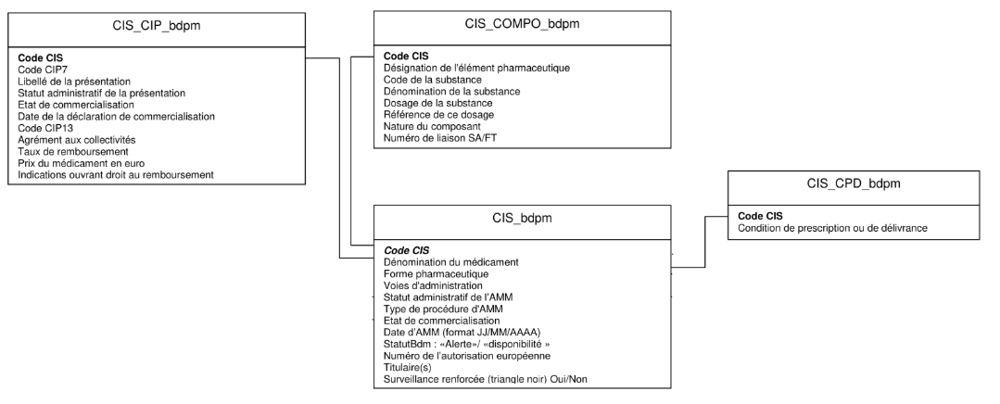

# English Version

## 🧠 Data Engineering Technical Test

### 🎯 Objective
The purpose of this challenge is to demonstrate your end-to-end data engineering and analytical skills.
You will design a small but complete data pipeline — from sourcing heterogeneous data to cleaning, transforming, merging, and store it — all within a notebook or python script.

Specifically, this test will assess your ability to:

1 - Source data from multiple file types and locations (CSV, TXT, Parquet, remote URLs, and S3).
2 - Understand and clean complex data structures, handling missing, inconsistent, or duplicated entries.
3 - Write clean, modular, and functional code with appropriate documentation and organization.
4 - Store your your final dataset in the results folder. Name it final.parquet and run tests.

### Preparation
To avoid constrains during the 1h interview, the following steps can be done prior:
- Download the given repository
- Access the data and inspect the formats
- Inspect the config.py and the image.png to help you on your development.
- Setup your environment (installs requirements in a dedicated environment to avoid package conflicts)
- # ENSURE EVERY HELPER (Copilot, ChatGPT, etc... is disabled)

### Data

#### 📦 Data Sources

| Dataset          | Description                   | Location                                                                                          |
| ---------------- | ----------------------------- | ------------------------------------------------------------------------------------------------- |
| `CIS_bdpm`       | Medicinal product reference   | `s3://data-eng-interviews/CIS_bdpm.txt` (or `https://data-eng-interviews.s3.eu-west-3.amazonaws.com/CIS_bdpm.txt`) |                                                          |
| `CIS_CIP_bdpm`   | Product packaging and codes   | `s3://data-eng-interviews/CIS_CIP_bdpm.parquet` (or `https://data-eng-interviews.s3.eu-west-3.amazonaws.com/CIS_CIP_bdpm.parquet`)|
| `CIS_COMPO_bdpm` | Product composition details   | `s3://data-eng-interviews/CIS_COMPO_bdpm.csv` (or `https://data-eng-interviews.s3.eu-west-3.amazonaws.com/CIS_COMPO_bdpm.csv`)|
| `CIS_CPD_bdpm`   | Public medication information | `https://base-donnees-publique.medicaments.gouv.fr/download/file/CIS_CPD_bdpm.txt`                |

### 🧩 Main Task
You must clean, transform, and merge the four datasets into a single consolidated table.
Once the final table is ready, save it into a folder called results such has:
`data-eng-interviews/results/final.parquet`

Your code should be structured, efficient, and easily reproducible.

### ⚙️ Deliverables & Execution
The workflow should be developed in the pulled repository and should run through the given main.py or a notebook using `run_all`

At the end of the interview, you’ll be asked to:

- Run the pipeline
- Test the final output
- Explaine your code

💡 Tip: You may persist intermediate outputs (e.g., CSV or Parquet files).

### Final Data Format

- Columns with allowed null values: [cip7_code, cip13_code, dosage, condition_d_prescription] (the remaining columns should not contains null values)
- Ensure correct column formats: [int, float, object]
- The final table should contain only the columns: [`cis_code`, `denomination_du_medicament`, `form_pharmaceutique`, `cip7_code`, `titulaire`, `survaillance_reinforce`, `cip13_code`, `pharma_element`, `code_de_substance`, `nom_de_substance`, `dosage`, `condition_d_prescription`]

### Data Linkage Chart

The following diagram illustrates the intended relationship between the different data sources:

### ✅ Evaluation Criteria

| Category                           | Description                                           |
| ---------------------------------- | ----------------------------------------------------- |
| **Data Sourcing**                  | Ability to handle multiple formats and remote sources |
| **Data Cleaning & Transformation** | Quality, logic, and robustness of preprocessing       |
| **Code Structure & Readability**   | Clarity, modularity, and documentation                |
| **Data Analysis & Visualization**  | Quality of dashboard insights and readability         |
| **Reproducibility**                | Dockerization and ease of setup/run                   |
| **Version Control**                | Commit quality, branching, and GitHub organization    |

### Helpfull Tips:
- When sourcing the data files:
  1. Inspect Encoding
  2. Inspect separators format

# French Version

## 🧠 Test Technique – Data Engineering
### 🎯 Objectif

L’objectif de ce challenge est de démontrer vos compétences en data engineering et en analyse de données de bout en bout.
Vous devrez concevoir un petit pipeline de données complet — depuis la collecte de données hétérogènes jusqu’au nettoyage, la transformation, la fusion et le stockage — le tout dans un notebook ou un script Python.

Plus précisément, ce test évaluera votre capacité à :

1 - Collecter des données à partir de multiples formats et emplacements (CSV, TXT, Parquet, URLs distantes et S3).
2 - Comprendre et nettoyer des structures de données complexes, en gérant les valeurs manquantes, incohérentes ou dupliquées.
3 - Écrire un code propre, modulaire et fonctionnel avec une documentation et une organisation appropriées.
4 - Stocker votre dataset final dans le dossier results. Le nommer final.parquet et exécuter les tests.

### 🧰 Préparation

Afin d’éviter des contraintes pendant l’entretien d’une heure, les étapes suivantes peuvent être réalisées en amont :

Télécharger le repository fourni

Accéder aux données et inspecter les formats

Examiner le config.py et le image.png pour vous guider dans votre développement

Configurer votre environnement (installer les dépendances dans un environnement dédié afin d’éviter les conflits de packages)

⚠️ S’ASSURER QUE TOUT ASSISTANT (Copilot, ChatGPT, etc.) EST DÉSACTIVÉ

### 📦 Données
#### Sources de données

| Dataset          | Description                        | Location                                                                                          |
| ---------------- | -----------------------------------| ------------------------------------------------------------------------------------------------- |
| `CIS_bdpm`       | Référentiel des produits médicaux  | `s3://data-eng-interviews/CIS_bdpm.txt` (ou `https://data-eng-interviews.s3.eu-west-3.amazonaws.com/CIS_bdpm.txt`)|
| `CIS_CIP_bdpm`   | Codes et conditionnements produits | `s3://data-eng-interviews/CIS_CIP_bdpm.parquet` (or `https://data-eng-interviews.s3.eu-west-3.amazonaws.com/CIS_CIP_bdpm.parquet`)|
| `CIS_COMPO_bdpm` | Détails de composition des produits| `s3://data-eng-interviews/CIS_COMPO_bdpm.csv` (or `https://data-eng-interviews.s3.eu-west-3.amazonaws.com/CIS_COMPO_bdpm.csv`)|
| `CIS_CPD_bdpm`   | Public medication information      | `https://base-donnees-publique.medicaments.gouv.fr/download/file/CIS_CPD_bdpm.txt`                |

### 🧩 Tâche principale

Vous devez nettoyer, transformer et fusionner les quatre jeux de données en une table consolidée unique.
Une fois la table finale prête, enregistrez-la dans un dossier nommé results, comme suit :
data-eng-interviews/results/final.parquet

Votre code doit être structuré, efficace et facilement reproductible.

### ⚙️ Livrables & Exécution

Le workflow doit être développé dans le repository cloné et doit s’exécuter via le main.py fourni ou via un notebook utilisant run_all.

À la fin de l’entretien, il vous sera demandé de :

Exécuter le pipeline

Tester le résultat final

Expliquer votre code

💡 Astuce : Vous pouvez persister des sorties intermédiaires (par exemple en CSV ou Parquet)

### Format Final des Données
- Colonnes autorisant des valeurs nulles : [cip7_code, cip13_code, dosage, condition_d_prescription] (les autres colonnes ne doivent pas contenir de valeurs nulles)

- Vérifier le format correct des colonnes : [int, float, object]

- Le tableau final doit contenir uniquement les colonnes : [`cis_code`, `denomination_du_medicament`, `form_pharmaceutique`, `cip7_code`, `titulaire`, `survaillance_reinforce`, `cip13_code`, `pharma_element`, `code_de_substance`, `nom_de_substance`, `dosage`, `condition_d_prescription`]

### 🗺️ Schéma de liaison des données

Le diagramme ci-dessous illustre la relation attendue entre les différentes sources de données :

### ✅ Critères d’évaluation
| Catégorie                          | Description                                                 |
| ---------------------------------- | ----------------------------------------------------------- |
| **Collecte des données**           | Capacité à manipuler plusieurs formats et sources distantes |
| **Nettoyage & Transformation**     | Qualité, logique et robustesse du prétraitement             |
| **Structure & Lisibilité du code** | Clarté, modularité et documentation                         |
| **Analyse & Visualisation**        | Pertinence et lisibilité du tableau de bord                 |
| **Reproductibilité**               | Maîtrise de Docker et simplicité d’exécution                |
| **Versionnement**                  | Qualité des commits, branches et organisation sur GitHub    |

## Conseils utiles:
- Lors de la collecte des fichiers de données :
  1. Vérifiez l’encodage
  2. Vérifiez le format des séparateurs